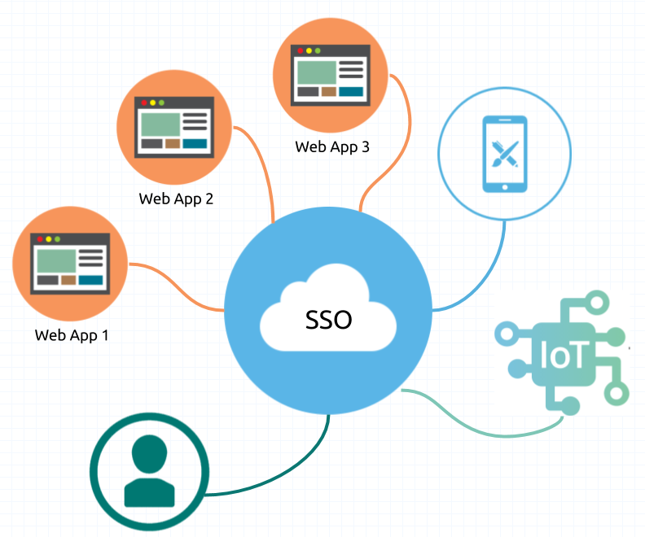

# SSO 서비스

SPRING BOOT 6년만에 처음함

## GOAL

Single Sign On 서비스 만들기



## TODO

0. 초기 세팅 - 완료 - (2시간)
1. _암호화 설정 + spring security(거지같은 것)_ - 비밀번호 bcrypt (공부하기)
2. _JWT 설정_
3. _REDIS 설정_
4. 로컬, 개발, 운영 환경변수 설정
5. 네트워크 설정

## 아키텍트 구성

```txt
                                                                                                                        ⬈ SSO 서버 1 ->         DB 1 (계정)
                                                          l7 (V-IP nginx - haproxy (인증 단, sso.api.bipa4.com 로드 밸런스))
                                                      ⬈                                                                 ⬊ SSO 서버 2 ->         REDIS (jwt 저장 및 계정 정보)
클라이언트  -> l4(gateway - 로드밸런스, 도메인 api.bipa4.com)
                                                      ⬊                                                                 ⬈ 어플리케이션 서버 1 ->   DB 2 (트랜잭션)
                                                          l7 (V-IP nginx - haproxy (서비스단,tv.api.bipa4.com, 로드 밸런스))
                                                                                                                        ⬊ 어플리케이션 서버 2 ->   DB 3 (조회)
```

## 기대값

1. 마이크로서비스를 한 번 만들어 보았다.
2. 무중단 서비스를 만들어 보았다.
3. 아키텍트를 구성해보았다.
